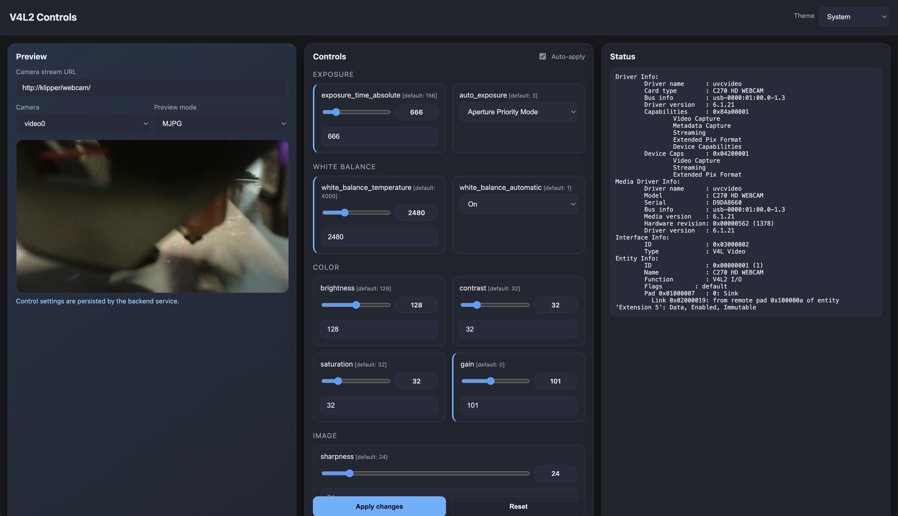

# v4l2-ctrls

Touch-friendly web UI for managing V4L2 camera controls with embedded video preview. This repository is a standalone extraction of code I contributed to the [`v4l2-mpp`](https://github.com/paxx12/v4l2-mpp) project, packaged so you can run it as an independent Flask app.



## Features

- Real-time V4L2 control adjustment via a web interface
- Automatic detection and handling of read-only controls
- Multi-camera support with embedded video streams
- Modern, colorful UI optimized for touch devices with light/dark theme support
- Reverse proxy compatible with flexible URL configuration
- LocalStorage persistence for user preferences (theme, camera selection, preview mode)
- Optional persistence for camera control settings with safe restore order

## Requirements

- Python 3.9+
- `v4l2-ctl` available in `PATH`
- A V4L2-compatible camera device (e.g., `/dev/video0`)

## Installation

See the full [installation guide](https://justinh-rahb.github.io/v4l2-ctrls/) for one-line installer instructions, systemd service setup, and troubleshooting.

**Quick manual install:**
```sh
git clone https://github.com/justinh-rahb/v4l2-ctrls.git
cd v4l2-ctrls
python3 -m venv .venv
source .venv/bin/activate
pip install -r requirements.txt
```

## Usage

**Single camera (auto-detect):**
```sh
python3 v4l2-ctrls.py
```

**Specify devices:**
```sh
python3 v4l2-ctrls.py --device /dev/video11
```

**Multiple cameras with custom configuration:**
```sh
python3 v4l2-ctrls.py \
  --device /dev/video11 \
  --device /dev/video12 \
  --port 5001 \
  --camera-url http://192.168.1.100/ \
  --app-base-url /camera-controls/ \
  --title "My Camera System"
```

**Custom stream endpoints:**
```sh
python3 v4l2-ctrls.py \
  --device /dev/video12 \
  --stream-prefix /dev/video12=/webcam2/ \
  --stream-path-webrtc "{prefix}webrtc" \
  --stream-path-mjpg "{prefix}stream.mjpg" \
  --stream-path-snapshot "{prefix}snapshot.jpg"
```

Open the UI at `http://<host>:<port>/` (default: `http://127.0.0.1:5000/`).

### Command-line options

- `--device <path>` - V4L2 device path (can be specified multiple times; auto-detects if omitted)
- `--host <address>` - Host to bind (default: `0.0.0.0`)
- `--port <number>` - Port to bind (default: `5000`)
- `--socket <path>` - Optional Unix socket path for socket-based serving
- `--camera-url <url>` - Base URL for camera streams (default: `http://127.0.0.1/`)
- `--app-base-url <path>` - Base URL path for UI routing when behind a reverse proxy (optional)
- `--title <text>` - Custom page title (optional)
- `--state-dir <path>` - Optional directory to persist control state (per camera JSON files)
- `--stream-prefix <key=path>` - Override stream prefix per camera (key can be device path, basename, or cam id)
- `--stream-path-webrtc <template>` - Template for WebRTC stream path (default: `{prefix}webrtc`)
- `--stream-path-mjpg <template>` - Template for MJPG stream path (default: `{prefix}stream.mjpg`)
- `--stream-path-snapshot <template>` - Template for snapshot stream path (default: `{prefix}snapshot.jpg`)

### URL template variables

The `--camera-url` option supports template variables for flexible stream routing:

- `{path}` - Full path including camera prefix and mode (e.g., `/webcam/stream.mjpg`)
- `{prefix}` - Camera prefix only (e.g., `/webcam/`)
- `{mode}` - Preview mode (e.g., `webrtc`, `mjpg`, `snapshot`)
- `{cam}` - Camera id (e.g., `video12`)
- `{device}` - Device path (e.g., `/dev/video12`)
- `{index}` - Camera index in the list (1-based)
- `{basename}` - Device basename (e.g., `video12`)

**Examples:**
```sh
# Simple append mode (default behavior)
--camera-url http://192.168.1.100/

# Path substitution
--camera-url http://192.168.1.100/streams/{path}

# Custom routing with prefix and mode
--camera-url http://192.168.1.100/{prefix}{mode}
```

### Stream path templates

The stream path options (`--stream-path-webrtc`, `--stream-path-mjpg`, `--stream-path-snapshot`) support the same
template variables as above, plus `{basename}` for the device basename (e.g., `video12`).

## Architecture overview

- `v4l2_ctrls/app.py` - Flask app factory and CLI entrypoint
- `v4l2_ctrls/routes.py` - HTTP route handlers
- `v4l2_ctrls/camera.py` - V4L2 device discovery and control parsing
- `v4l2_ctrls/utils.py` - Logging and helper utilities
- `templates/` - Jinja templates for the UI
- `static/` - CSS and JavaScript assets

## Documentation

- [Installation Guide](https://justinh-rahb.github.io/v4l2-ctrls/) - One-line installer, systemd setup, and troubleshooting
- [API Reference](.github/API.md) - REST API endpoints and examples
- [Architecture Overview](.github/ARCHITECTURE.md) - System design and components
- [Development Setup](.github/DEVELOPMENT.md) - Local development instructions

## API endpoints

- `GET /` - Main UI page
- `GET /api/cams` - List cameras and streamer configuration
- `GET /api/v4l2/ctrls?cam=<cam_id>` - Get available controls for device
- `POST /api/v4l2/set?cam=<cam_id>` - Apply control value changes (JSON body: `{"control_name": value}`)
- `GET /api/v4l2/info?cam=<cam_id>` - Get device information
- `GET /api/v4l2/debug?cam=<cam_id>` - Debug raw `v4l2-ctl` output

## Contributing

Pull requests are welcome. Please keep changes focused and include any relevant documentation or testing notes.

## License

This project is licensed under the MIT License. See [LICENSE](LICENSE).

## Credits

Extracted from the [`v4l2-mpp`](https://github.com/paxx12/v4l2-mpp) project to provide a standalone web utility.
Initial testing and debugging by [@horzadome](https://github.com/horzadome)
